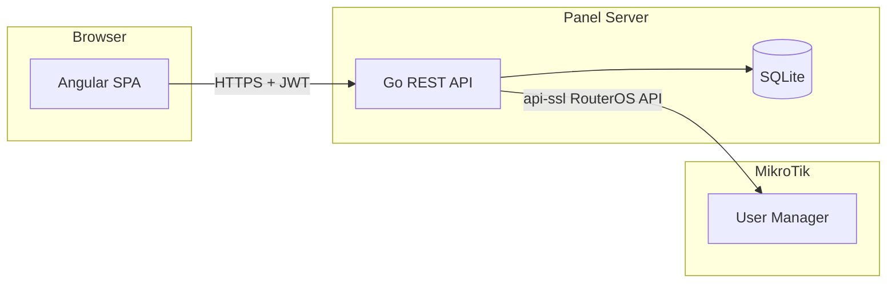
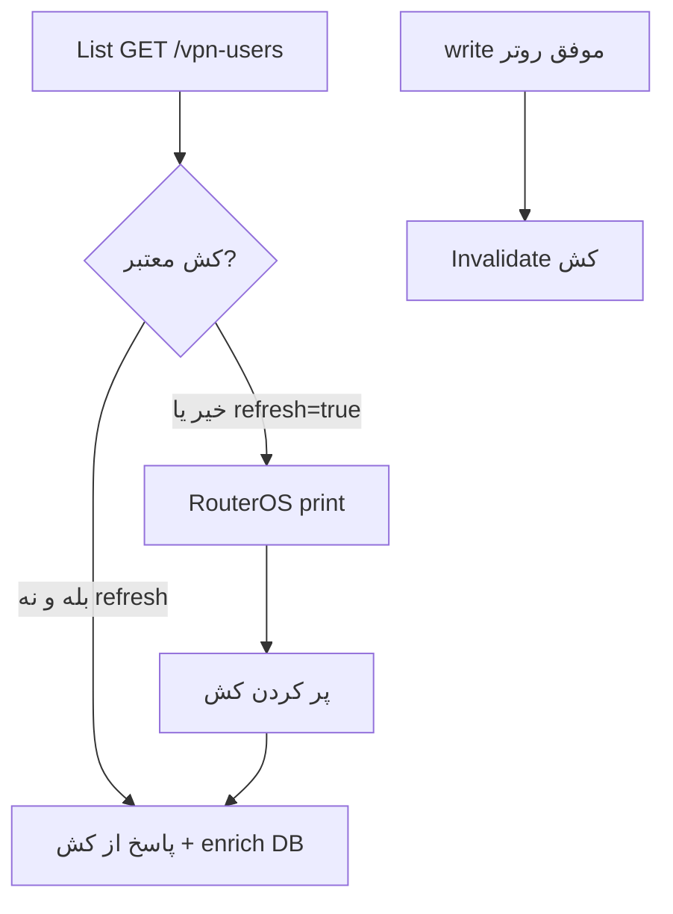

# معماری

## نمای کلی




## منبع حقیقت


| داده                                     | منبع حقیقت   | توضیح                                         |
| ---------------------------------------- | ------------ | --------------------------------------------- |
| کاربر VPN (name, password, shared-users) | **MikroTik** | هر تغییر ابتدا در روتر اعمال می‌شود           |
| پروفایل فعال / رزرو / end-time           | **MikroTik** | از `/user-manager/user-profile` خوانده می‌شود |
| حساب مدیر / ادمین پنل                    | **SQLite**   | احراز هویت پنل                                |
| تماس، یادداشت، پرداخت                    | **SQLite**   | روتر این‌ها را نگه نمی‌دارد                   |
| سقف (`quota`) و `slug` مدیر              | **SQLite**   | هنگام ایجاد کاربر اعمال می‌شود                |
| `cert_title` / `cert_key_pass` کاربر و مدیر | **SQLite**   | متادیتا؛ پسورد همیشه در پنل تولید می‌شود — [certificates.md](certificates.md) |
| گواهی و کلید (`cl-{title}`)              | **MikroTik** | اسکریپت `generate-certificate`؛ idempotent اگر وجود داشته باشد |
| فایل `config-{mikrotik_name}.ovpn`       | **MikroTik** | ساخته در **زمان ایجاد کاربر** (ادمین + `cert_title`)؛ دانلود فقط read |
| bundle اتصال — L2TP و fallback OpenVPN   | **env**      | `L2TP_*`, `OPENVPN_*` وقتی گواهی اختصاصی نیست |
| فایل `.ovpn` (fallback)                  | **قالب سرور** | `OPENVPN_TEMPLATE_PATH` + username/password از MikroTik |


اگر MikroTik موفق و SQLite ناموفق باشد (یا برعکس)، API باید **تراکنش جبرانی** داشته باشد: در صورت خطای DB بعد از موفقیت روتر، تلاش برای حذف/برگرداندن تغییر روتر و برگرداندن خطا به کلاینت.

## ساختار repository

```
fast-bypass/
├── backend/
│   ├── cmd/server/main.go
│   ├── internal/
│   │   ├── auth/          # JWT, middleware
│   │   ├── mikrotik/      # RouterOS client
│   │   ├── manager/       # quota, prefix
│   │   ├── vpnuser/       # CRUD + sync
│   │   └── store/         # SQLite
│   └── go.mod
├── frontend/
│   └── src/app/
│       ├── core/          # auth interceptor
│       ├── features/
│       │   ├── manager/   # dashboard, vpn users, renewals (read-only)
│       │   └── admin/     # managers, all users, renewals + settle
│       └── ...
├── db/schema.sql
└── docs/
```

## احراز هویت

- ورود با `username` + `password` → JWT access (کوتاه) + refresh (طولانی‌تر)
- نقش‌ها در claim: `role=admin|manager` و برای مدیر `manager_id`, `slug`
- مدیر با `is_active=0`: login رد می‌شود؛ middleware عملیات VPN را برای token قدیمی هم می‌بندد
- هر درخواست محافظت‌شده: Bearer token
- رمزها با **bcrypt** در SQLite

## جداسازی مدیرها

1. هر مدیر `slug` یکتا دارد (فقط `a-z0-9-`, ۳–۱۶ کاراکتر) و **همپوشانی پیشوندی** با slug مدیر دیگر ممنوع است (`ali` + `alireza` مجاز نیست).
2. **قرارداد نوشتن (مدیر):** نام MikroTik = `{slug}{separator}{local_name}` — مثال: `ali-reza01`؛ مدیر فقط `local_name` می‌فرستد.
3. **برچسب مالکیت در روتر:** `comment="panel={slug}"` — سرور در هر `user/add|set` از پنل ست می‌کند؛ مدیر در UI/API نمی‌بیند.
4. **تشخیص مالک (`resolve_owner`):** اول تطابق `name` با الگو؛ وگرنه توکن `panel={slug}` در `comment` (یا legacy `panel={slug}`)؛ در تضاد، **نام مقدم است** ([business-rules.md](business-rules.md)).
5. **یادداشت کسب‌وکار:** `vpn_user_meta.notes` در SQLite — جدا از `comment` روتر.
6. لیست کاربران مدیر: فیلتر روی کش/print روتر با `resolve_owner` = همان مدیر.

**بدون مدیر (orphan):** نه الگوی نام و نه `panel={slug}` روی هیچ مدیر — مثلاً `guest01` بدون comment. فقط ادمین فیلتر `orphan` و فیلد `mikrotik_comment` را می‌بیند. `manager_id` در SQLite از `resolve_owner` مشتق می‌شود، نه برعکس.

## پیکربندی

همه تنظیمات از env (فایل `.env` در dev). نمونه: [.env.example](../.env.example).

## منطقه زمانی

- همه زمان‌ها: **Asia/Tehran** — سرور Go (`TZ`)، parse `end-time`، نمایش Angular.
- روتر MikroTik در [testing.md](testing.md) روی همان timezone تنظیم شود.

## کش MikroTik



جزئیات TTL و باطل‌سازی: [business-rules.md](business-rules.md#کش-لیست-کاربران-mikrotik).

## غیرعملکردی


| موضوع  | تصمیم                                         |
| ------ | --------------------------------------------- |
| لاگ    | structured (slog)، بدون لاگ password          |
| Health | `GET /health` — DB ok؛ اختیاری ping MikroTik  |
| Backup | کپی فایل SQLite + export لیست کاربران از روتر |
| UI     | فارسی، RTL، responsive desktop-first          |


## امنیت

- HTTPS برای پنل در production اجباری
- credential روتر فقط سمت سرور
- مدیر **credential API روتر** (`MIKROTIK_USERNAME` / `MIKROTIK_PASSWORD`) را نمی‌بیند؛ اما **رمز VPN مشتری** و bundle اتصال را در `/users/:id` برای تحویل به مشتری می‌بیند
- endpointهای `connection_bundle` و `/ovpn`: فقط مالک یا ادمین؛ بدون لاگ password / `cert_key_pass` در slog
- ساخت گواهی فقط ادمین؛ مدیر UI گواهی نمی‌بیند — [certificates.md](certificates.md)
- Rate limit روی `/auth/login`
- Audit log (فاز ۲ اختیاری): جدول `audit_events` برای create/delete/assign

