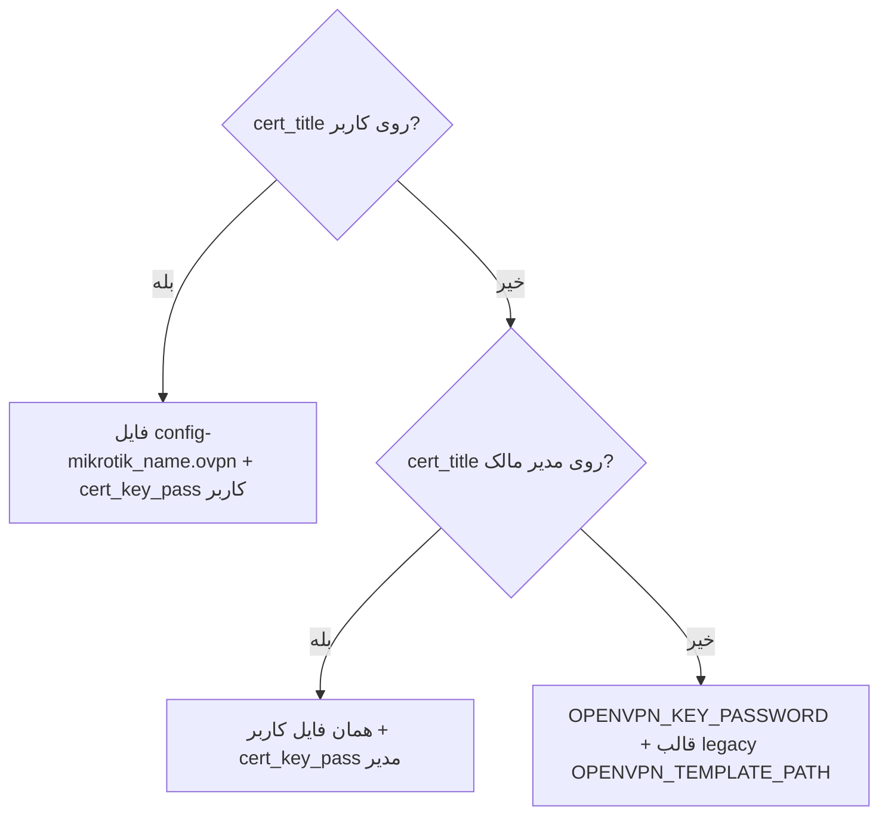

# گواهی OpenVPN و فایل `.ovpn`

این سند قرارداد طراحی و رفتار پیاده‌س‌شده ماژول گواهی است. اسکریپت روتر: [mikrotik/generate-certificate.rsc](../mikrotik/generate-certificate.rsc).

## خلاصه

| موضوع | تصمیم |
|--------|--------|
| چه کسی گواهی می‌سازد | فقط **ادمین** (فیلد `cert_title` در فرم ایجاد کاربر/مدیر — مدیر UI نمی‌بیند) |
| زمان ساخت | **هنگام ایجاد** کاربر یا مدیر (نه هنگام دانلود — ساخت گواهی زمان‌بر است) |
| یکتایی `cert_title` در DB | **خیر** — چند کاربر می‌توانند یک `cert_title` مشترک داشته باشند |
| پسورد کلید خصوصی | همیشه در **پنل** تولید و به اسکریپت ارسال می‌شود؛ در SQLite ذخیره؛ فایل‌های `.pass` روی روتر **هرگز** خوانده/دانلود نمی‌شوند |
| فایل‌های `.ovpn` روی روتر | منبع حقیقت عملیاتی؛ نام تحویلی هر کاربر: `config-{mikrotik_name}.ovpn` |
| UI مدیر | **بدون تغییر** — همان کارت اتصال؛ سرور بر اساس اولویت پسورد و نوع فایل را برمی‌گرداند |

## مدل داده (SQLite)

ستون‌های پیش‌بینی‌شده (بدون `UNIQUE` روی `cert_title`):

| جدول | ستون | توضیح |
|------|------|--------|
| `vpn_user_meta` | `cert_title` | عنوان گواهی در روتر (آرگومان `TITLE` اسکریپت)؛ اختیاری |
| `vpn_user_meta` | `cert_key_pass` | پسورد export کلید خصوصی؛ فقط وقتی برای این کاربر گواهی ساخته شده |
| `managers` | `cert_title` | گواهی پیش‌فرض مدیر برای کاربران بدون `cert_title` خودشان |
| `managers` | `cert_key_pass` | پسورد همان گواهی مدیر |

- چند ردیف می‌توانند `cert_title` یکسان داشته باشند (اشتراک گواهی).
- پسوردها در API/لاگ نوشته نمی‌شوند؛ ذخیره در DB با رمزنگاری در لایه اپلیکیشن توصیه می‌شود.

## اسکریپت MikroTik — `generate-certificate`

ورودی‌ها (متغیر global):

| متغیر | اجباری | توضیح |
|--------|--------|--------|
| `TITLE` | بله | عنوان گواهی (`cl-{TITLE}`، export به `{TITLE}.crt` / `.key`) |
| `PASSPHRASE` | خیر (پنل همیشه می‌فرستد) | حداقل ۸ کاراکتر؛ پنل تولید می‌کند |

رفتار idempotent:

- اگر گواهی `cl-{TITLE}` وجود داشته باشد، دوباره ساخته **نمی‌شود**.
- اگر فایل پایه export برای همان `TITLE` وجود داشته باشد، export مجدد انجام **نمی‌شود**.

پنل **خروجی** `:put` اسکریپت را برای استخراج پسورد parse **نمی‌کند** — مقدار ارسالی به اسکریپت همان مقدار ذخیره‌شده در DB است.

فایل‌های `.pass` روی روتر (`{TITLE}.pass`) ممکن است توسط اسکریپت نوشته شوند؛ پنل آن‌ها را **نمی‌خواند**.

## فایل `.ovpn` روی روتر

| فایل | نقش |
|------|------|
| خروجی export اسکریپت (مرجع گواهی) | وابسته به `TITLE` — مثلاً `config-{TITLE}.ovpn` تا زمان هم‌راستاسازی اسکریپت |
| فایل تحویل هر کاربر | **`config-{mikrotik_name}.ovpn`** — در زمان **ایجاد کاربر** (با گواهی) ساخته/به‌روز می‌شود |

هنگام ساخت فایل کاربر، حداقل این patch اعمال می‌شود:

```
setenv FRIENDLY_NAME "Sabalan {mikrotik_name}"
```

(تغییر `remote` / نشانی سرور از env پنل در فاز بعد — [TODO.md](../TODO.md).)

دانلود (`GET .../ovpn`): خواندن `config-{mikrotik_name}.ovpn` از روتر (بدون اجرای اسکریپت). اگر فایل وجود نداشت و مسیر legacy فعال است → قالب env.

## زنجیره اولویت — پسورد و منبع کانفیگ

برای `connection_bundle.openvpn_key_password` و انتخاب بدنهٔ `GET .../ovpn`:



| شرط | `openvpn_key_password` | فایل `.ovpn` |
|-----|------------------------|--------------|
| کاربر `cert_title` دارد | `vpn_user_meta.cert_key_pass` | گواهی‌محور: `config-{mikrotik_name}.ovpn` از روتر |
| کاربر ندارد، مدیر `cert_title` دارد | `managers.cert_key_pass` | همان فایل per-user روی روتر + پسورد **مدیر** (هر دو با هم) |
| هیچ‌کدام | env `OPENVPN_KEY_PASSWORD` | قالب legacy + `{{username}}` / `{{password}}` |

**ممنوع:** ترکیب `cert_title` کاربر با `cert_key_pass` مدیر (یا برعکس).

## جریان ایجاد — ادمین

### کاربر VPN (`POST /admin/vpn-users` / `PATCH /admin/vpn-users/:id`)

**ویرایش `cert_title` (ادمین):**

| قبل | بعد | رفتار |
|-----|-----|--------|
| خالی | عنوان جدید | صدور گواهی + `config-{mikrotik_name}.ovpn` |
| پر | عنوان دیگر | دیالوگ تأیید در UI؛ PATCH همان `cert_title` جدید کافی است |
| پر | خالی | فقط پاک کردن `cert_title` / `cert_key_pass` در DB (بدون حذف فایل روی روتر) |

### ایجاد کاربر (`POST /admin/vpn-users`)

1. ایجاد کاربر در User Manager (همان جریان فعلی).
2. اگر بدنه شامل `cert_title` (غیرخالی) بود:
   - پنل `cert_key_pass` تصادفی تولید می‌کند (همان charset/حداقل طول اسکریپت).
   - اجرای `generate-certificate` با `TITLE` + `PASSPHRASE`.
   - ساخت/به‌روزرسانی `config-{mikrotik_name}.ovpn` روی روتر (شامل `setenv FRIENDLY_NAME`).
   - ذخیره `cert_title` + `cert_key_pass` در `vpn_user_meta`.
3. اگر `cert_title` خالی بود: هیچ گواهی‌ای ساخته نمی‌شود (کاربران ساخته‌شده توسط مدیر معمولاً این حالت را دارند).

مدیر در `POST /vpn-users` فیلد گواهی **ندارد**.

### کاربر ساخته‌شده توسط مدیر — گواهی مشترک مدیر

اگر کاربر `cert_title` ندارد ولی مدیر مالک (`resolve_owner`) `cert_title` دارد:

- اسکریپت `generate-certificate` **دوباره** برای همان `TITLE` اجرا نمی‌شود (گواهی از قبل هست).
- در **پایان همان درخواست ایجاد کاربر** پنل فقط `config-{mikrotik_name}.ovpn` را روی روتر می‌سازد (از material گواهی مدیر + `setenv FRIENDLY_NAME`).
- `cert_key_pass` در meta کاربر ذخیره **نمی‌شود** — در زمان نمایش/دانلود از `managers.cert_key_pass` استفاده می‌شود.

### مدیر (`POST /admin/managers` / `PATCH /admin/managers/:id`)

- **ایجاد:** با `cert_title` → اسکریپت + ذخیره در `managers`.
- **ویرایش:** همان جدول «قبل/بعد» کاربر (خالی→جدید، پر→دیگر با دیالوگ تأیید، پر→خالی = پاک DB)؛ پس از تأیید PATCH → گواهی جدید و پسورد تازه؛ loading تا پایان درخواست.

## جریان دانلود — مدیر و ادمین

- UI مدیر **تغییر نمی‌کند** (همان «رمز کلید OpenVPN» و «دانلود ovpn»).
- API بر اساس جدول اولویت بالا مقدار و نوع فایل را برمی‌گرداند.
- `Content-Disposition`: `{mikrotik_name}.ovpn` (نام دانلود در مرورگر؛ فایل روی روتر `config-{mikrotik_name}.ovpn`).

## تراکنش و خطا

ترتیب پیشنهادی: User Manager → اسکریپت گواهی → فایل `config-{name}.ovpn` → SQLite.

اگر DB بعد از موفقیت روتر fail شود: جبران (حذف کاربر روتر / علامت‌گذاری برای پاک‌سازی دستی) — همان الگوی [architecture.md](architecture.md).

## API (خلاصه — جزئیات در [api.md](api.md))

| نقش | ایجاد | دانلود |
|-----|--------|--------|
| Admin | `cert_title` اختیاری در `POST /admin/vpn-users` و `POST /admin/managers` | `GET /admin/vpn-users/:id/ovpn` |
| Manager | بدون فیلد گواهی | `GET /vpn-users/:id/ovpn` — رفتار شفاف از اولویت |

فیلدهای `cert_title` / `cert_key_pass` در پاسخ API مدیر **لازم نیست** (فقط نتیجه در `connection_bundle`).

## پذیرش (ماژول گواهی)

- [x] چند کاربر با `cert_title` یکسان؛ اسکریپت idempotent
- [x] ساخت گواهی در create (admin)؛ دانلود read فایل روتر
- [x] پسورد از پنل به اسکریپت؛ بدون fetch `.pass`
- [x] اولویت user → manager → env
- [x] UI مدیر بدون فیلد گواهی؛ bundle از سرور
- [x] فایل روتر: `config-{mikrotik_name}.ovpn` + `setenv FRIENDLY_NAME`
- [x] Fake MikroTik + تست integration

Migration دستی: [db/migrations/README.md](../db/migrations/README.md)
