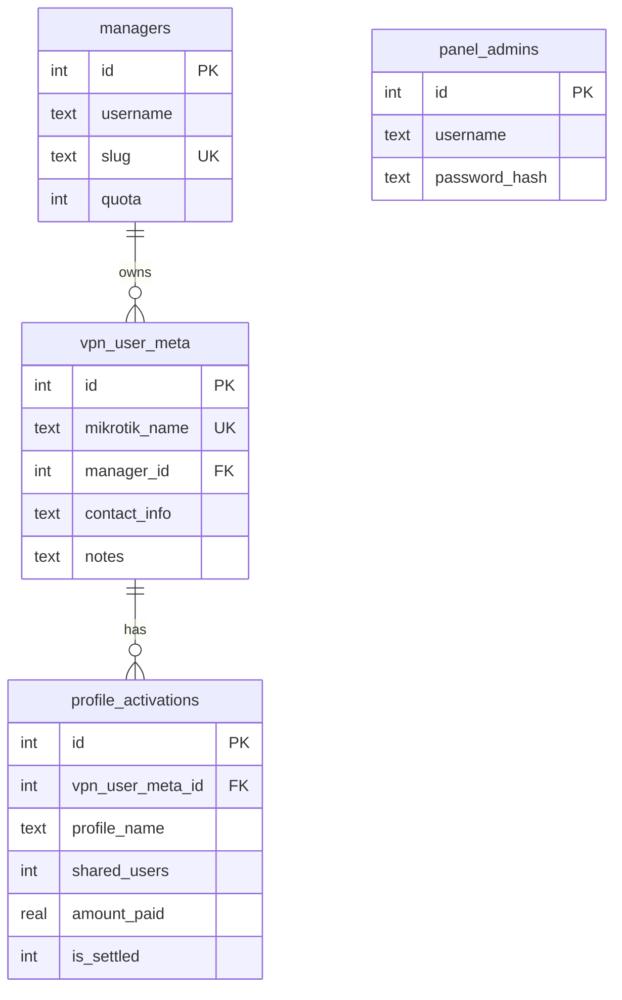

# مدل داده

## ER (پنل)

DDL کامل: [db/schema.sql](../db/schema.sql).

## جدول `managers`

| ستون | نوع | توضیح |
|------|-----|--------|
| `username` | TEXT | ورود به پنل — فقط ادمین |
| `display_name` | TEXT | نام نمایشی — مدیر با `PATCH /me` |
| `slug` | TEXT | پیشوند نام VPN؛ یکتا؛ **بدون همپوشانی پیشوندی** — فقط ادمین |
| `quota` | INT | سقف **اسلات اتصال همزمان** (جمع `shared-users` کاربران با پروفایل فعال) |
| `is_active` | INT | `0` = غیرفعال (ورود مسدود) — ویرایش توسط ادمین |
| `password_hash` | TEXT | bcrypt |

## جدول `vpn_user_meta`

یک ردیف به ازای هر کاربر MikroTik که پنل می‌شناسد.

| ستون | توضیح |
|------|--------|
| `mikrotik_name` | نام کامل در روتر، مثلاً `ali-reza01` |
| `manager_id` | FK به مدیر؛ از **`resolve_owner(mikrotik_name, comment)`** در روتر — اگر orphan باشد `NULL` یا ناسازگار با روتر (هشدار) |
| `contact_info` | اطلاعات تماس (تلگرام، ایمیل، …) — اختیاری |
| `notes` | یادداشت آزاد پنل — **جایگزین `comment` روتر برای مدیر**؛ در MikroTik ذخیره نمی‌شود |

## جدول `profile_activations`

هر بار مدیر **پروفایل assign** می‌کند (تمدید = assign مجدد همان پروفایل)، یک ردیف ثبت می‌شود.

| ستون | توضیح |
|------|--------|
| `profile_name` | معمولاً `profile-open-2M-30d` |
| `shared_users` | اتصال همزمان دوره — در assign از MikroTik کپی می‌شود؛ برای ردیف **تسویه‌نشده** با روتر هم‌خوان می‌ماند (پچ پنل یا heal هنگام خواندن)؛ ردیف **تسویه‌شده** ثابت می‌ماند |
| `amount_paid` | **اختیاری** — `NULL` (ثبت نشده)، `0`، یا مبلغ مثبت |
| `currency` | پیش‌فرض `IRR`؛ فقط وقتی مبلغ ثبت شده معنی دارد |
| `paid_at` | ISO8601؛ اختیاری |
| `mikrotik_end_time` | کپی `end-time` بعد از assign (برای گزارش) |
| `is_settled` | `0` = تسویه نشده (ادمین)؛ `1` = تسویه شده |
| `settled_at` | زمان علامت‌گذاری تسویه توسط ادمین؛ `NULL` اگر unsettled |
| `settled_by_admin_id` | FK اختیاری به `panel_admins` |

## نگاشت به MikroTik

| پنل | MikroTik path | فیلد |
|-----|---------------|------|
| نام VPN | `/user-manager/user` | `name` |
| رمز | همان | `password` |
| اتصال همزمان | همان | `shared-users` |
| پروفایل | `/user-manager/user-profile` | `profile`, `user` |
| وضعیت/پایان | همان | `state`, `end-time` (read-only) |
| برچسب مالکیت | `/user-manager/user` | `comment` = `panel={slug}` — فقط سرور/ادمین؛ **خارج از پاسخ API مدیر** |

### `comment` در مقابل `notes`

| | `comment` (MikroTik) | `notes` (SQLite) |
|--|----------------------|------------------|
| فرمت | `panel={slug}` ثابت | متن آزاد |
| چه کسی می‌بیند | فقط **ادمین** (`mikrotik_comment`) | **مدیر** + ادمین |
| چه کسی می‌نویسد | سرور پنل (هر write)؛ ادمین در Winbox برای legacy | مدیر در `PATCH /vpn-users/:id` |
| نقش | مالکیت / import legacy | یادداشت مشتری |

## محدودیت نام

- ایجاد توسط **مدیر**: بدنه `local_name` = بخش بعد از پیشوند؛ سرور `mikrotik_name = name_prefix + local_name`
- ایجاد **بدون مدیر** (ادمین): `local_name` = نام کامل روتر (حداکثر ۳۲ کاراکتر)
- الگوی بخش نام: `^[a-z0-9][a-z0-9_-]{2,23}$` (قابل تنظیم با `USERNAME_LOCAL_MAX_LEN`)
- `slug` + separator + `local_name` ≤ ۳۲ کاراکتر (محدودیت عملی RouterOS/User Manager)
- یکتا بودن `mikrotik_name` در DB و در روتر
- `slug` مدیر: هنگام insert/update بررسی همپوشانی پیشوندی (`SLUG_OVERLAPS`)

## ایندکس و کوئری‌های متداول

- لیست کاربران مدیر: enrich از MikroTik؛ نگه‌داشتن ردیف‌هایی که `resolve_owner` = `manager_id` جاری
- Orphans: `resolve_owner` = بدون مدیر
- ناهماهنگی DB: `manager_id` ≠ نتیجه `resolve_owner` → هشدار
- تضاد روتر: نام با الگوی `m1` ولی `comment="panel=m2"` → هشدار ادمین؛ مالک = `m1`
- مصرف quota: جمع `shared-users` از API برای کاربرانی که `state` فعال است (منطق در [business-rules.md](business-rules.md))
- دفتر تمدید: `profile_activations` JOIN `vpn_user_meta`؛ scope با `resolve_owner` (مدیر / orphan) — [api.md](api.md#admin--renewals-ledger)، مدیر: `GET /renewals`
