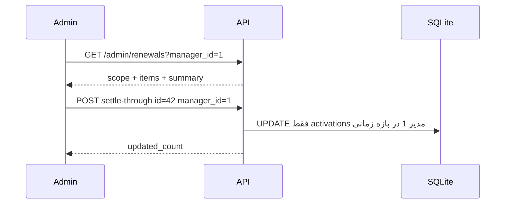
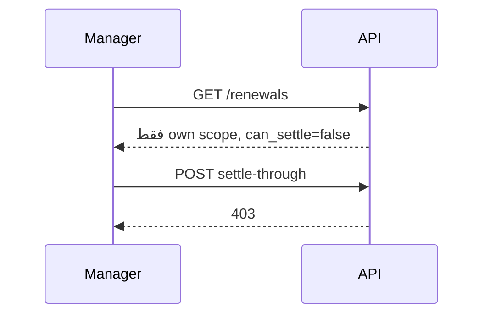
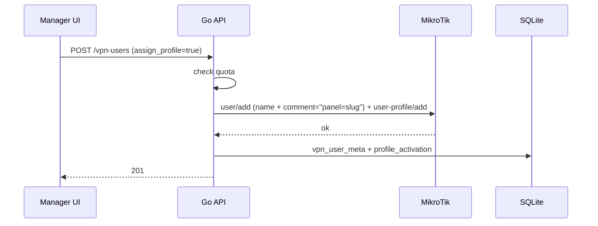

# جریان کاربر و UI

## نقشه صفحات

### مدیر

| مسیر | صفحه | عملکرد |
|------|------|--------|
| `/login` | ورود | username/password |
| `/` | داشبورد | کارت quota (used/available)، تعداد کاربران فعال |
| `/users` | لیست کاربران | جدول + دکمه «بروزرسانی» (`?refresh=true`)؛ زمان‌ها وقت تهران |
| `/users/new` | ایجاد | پیشوند ثابت (`name_prefix` از `/me`) + textbox `local_name` + پیش‌نمایش نام کامل روتر |
| `/users/:id` | جزئیات | **بالا:** کارت «اطلاعات اتصال برای مشتری»؛ **فرم ویرایش یکپارچه** (فعال، رمز VPN، اتصال همزمان، تماس، یادداشت)؛ سپس assign، رزرو، تاریخچه — **بدون** `comment` روتر |
| `/settings` | تنظیمات حساب | ویرایش **نام نمایشی** (`PATCH /me`)؛ بخش تغییر رمز (`POST /me/password`) |
| `/settings` (فقط خواندنی) | — | `username`، `slug`، `quota` / مصرف — بدون امکان ویرایش |
| `/renewals` | دفتر تمدیدها — **فقط تمدیدهای خود**؛ تسویه فقط مشاهده |

### ادمین

| مسیر | صفحه |
|------|------|
| `/admin` | داشبورد — تعداد مدیران، **کاربران فعال**، جمع اتصال همزمان، orphan، جدول **به تفکیک مدیر** |
| `/admin/managers` | لیست مدیران — ایجاد با slug بدون همپوشانی، ویرایش quota، غیرفعال/فعال |
| `/admin/settings` | تنظیمات ادمین | همان `/settings` مدیر (نام نمایشی + رمز) |
| `/admin/users` | لیست همه VPN — فیلتر مدیر / بدون مدیر؛ **ستون «مدیر»** در هر ردیف؛ دکمه «کاربر جدید» |
| `/admin/users/new` | ایجاد کاربر VPN — مدیر اختیاری (`POST /admin/vpn-users`؛ بدون `manager_id` = orphan) |
| `/admin/users/:id` | ایجاد/ویرایش/حذف — همان قابلیت‌های `/users/:id` مدیر + نمایش مالک + `mikrotik_comment` |
| `/admin/renewals` | دفتر تمدید — فیلتر مدیر (پیش‌فرض: بدون مدیر) + تسویه تا رکورد |

### ادمین — `/admin` (داشبورد)

API: `GET /admin/stats` — یک‌بار از MikroTik (کش؛ `?refresh=true` برای بروزرسانی).

| کارت / بخش | معنی |
|------------|------|
| تعداد مدیران | `manager_count` |
| کاربران فعال | `totals.vpn_users` — غیرغیرفعال در روتر + پروفایل فعال |
| جمع اتصال همزمان | `totals.connections` — جمع `shared_users` همان کاربران فعال (برابر منطق `used_quota`) |
| بدون مدیر | `orphan.connections` + تعداد کاربر فعال (`orphan.vpn_users`) |
| جدول به تفکیک مدیر | `by_manager[]`: نام، کاربران فعال، اتصال، مصرف/سقف (`connections / quota`) |

لینک هر مدیر → `/admin/users?manager_id={id}`.

---

## دفتر تمدیدها — مشترک

**ترتیب ستون‌ها (ستون ۱ همیشه تاریخ تمدید):**

| # | ستون | فیلد API |
|---|------|----------|
| 1 | **تاریخ تمدید** | `renewed_at` (شمسی) |
| 2 | نام کاربر | `mikrotik_name` |
| 3 | تعداد اتصالات همزمان | `shared_users` |
| 4 | نام پروفایل | `profile_name` |
| 5 | وضعیت پروفایل | `profile_state` → chip |
| 6 | تاریخ اعتبار | `mikrotik_end_time` (شمسی) |
| 7 | تسویه شده | `is_settled` → ✓ / ✗ (فقط خواندنی برای مدیر) |
| 8 | عمل | فقط ادمین — «تسویه تا اینجا» |

جمع بالای صفحه (در scope فعلی): `unsettled_shared_users_sum` + اختیاری `all_shared_users_sum`.

---

## مدیر — `/renewals`

### هدف

مدیر **همه تمدیدهای کاربران خود** را می‌بیند (برای پیگیری دوره‌ها و وضعیت تسویه با ادمین)، بدون امکان تغییر تسویه.

### wireframe

```
┌─────────────────────────────────────────────────────────────────────────┐
│  تمدیدهای من                                                             │
├─────────────────────────────────────────────────────────────────────────┤
│  جمع اتصال (تسویه‌نشده): ۱۲    │  مدیر: علی احمدی (ثابت، غیرقابل تغییر) │
│  [تسویه: همه|نشده|شده] [جستجو…]                                         │
├─────────────────────────────────────────────────────────────────────────┤
│ تاریخ تمدید │ کاربر │ اتصال │ پروفایل │ وضعیت │ اعتبار │ تسویه        │
│ ۱۴۰۴/۰۳/۰۱  │ …     │  2    │ …       │ فعال  │ …      │  ✗           │
└─────────────────────────────────────────────────────────────────────────┘
```

- API: `GET /renewals` — سرور همیشه `manager_id` = مدیر جاری
- **بدون** dropdown مدیر؛ **بدون** ستون/دکمه «تسویه تا اینجا»
- `can_settle: false` در پاسخ

---

## ادمین — `/admin/renewals`

### هدف

تمدیدها در محدودهٔ **یک مدیر انتخاب‌شده** یا — اگر مدیر انتخاب نشده — **فقط کاربران بدون مدیر (orphan)**. ادمین می‌تواند تسویه را تا یک ردیف علامت بزند.

### فیلتر مدیر (رفتار اجباری)

| انتخاب UI | query API | محتوای لیست |
|-----------|-----------|-------------|
| *(هیچ — پیش‌فرض)* | بدون `manager_id` | فقط تمدیدهای **orphan** |
| مدیر «علی» | `manager_id=1` | فقط تمدیدهای کاربران مالکیت‌شده توسط علی |
| «بدون مدیر» (صریح در dropdown) | بدون `manager_id` | همان orphan |

**نه** «همه مدیران با هم» — برای دیدن کل سیستم باید مدیر را یکی‌یکی انتخاب کرد یا حالت orphan.

### wireframe

```
┌─────────────────────────────────────────────────────────────────────────┐
│  دفتر تمدیدها                                                            │
├─────────────────────────────────────────────────────────────────────────┤
│  جمع اتصال (تسویه‌نشده): ۴۵  │  محدوده: مدیر علی / بدون مدیر           │
│  فیلتر: [انتخاب مدیر ▼]  ← پیش‌فرض: «بدون مدیر»                         │
│         [تسویه: همه|نشده|شده] [جستجو…]                                  │
├─────────────────────────────────────────────────────────────────────────┤
│ تاریخ تمدید │ کاربر │ اتصال │ پروفایل │ وضعیت │ اعتبار │ تسویه │ عمل   │
│ ۱۴۰۴/۰۳/۰۱  │ ali-… │   2   │ open-2M │ فعال  │ ۱۴۰۴/… │  ✗    │[تا اینجا]│
│ ۱۴۰۴/۰۲/۱۵  │ bob-… │   1   │ open-2M │ منقضی │ ۱۴۰۴/… │  ✓    │  —      │
└─────────────────────────────────────────────────────────────────────────┘
```

### دکمه «تسویه تا اینجا» (فقط ادمین)

1. scope فعلی (مدیر انتخاب‌شده یا orphan) باید با لیست هم‌خوان باشد  
2. `POST /admin/renewals/settle-through` با `{ through_activation_id, manager_id? }`  
3. فقط unsettledهای همان scope و قدیمی‌تر/هم‌زمان با ردیف N

### سناریو ۶ — ادمین: تسویه در محدوده مدیر



### سناریو ۷ — مدیر: مشاهده بدون تسویه



## فرم ایجاد کاربر — پیشوند (UX)

```
┌─────────────────────────────────────────────┐
│ نام کاربر VPN                               │
│  ┌────────┐ ┌──────────────────────────┐   │
│  │ ali-   │ │ reza01                   │   │
│  └────────┘ └──────────────────────────┘   │
│  پیشوند (ثابت)    بخش قابل ورود          │
│                                             │
│  نام نهایی در روتر: ali-reza01              │
└─────────────────────────────────────────────┘
```

- پیشوند از `GET /me` → `name_prefix` (غیرقابل ویرایش)
- API فقط `local_name` می‌گیرد؛ سرور `mikrotik_name = name_prefix + local_name` و `comment="panel={slug}"` می‌سازد
- فیلد **یادداشت** در فرم = `notes` (SQLite) — نه `comment` روتر
- **اطلاعات تماس** = `contact_info`
- اعتبارسنجی طول: `len(name_prefix) + len(local_name) ≤ 32`

## فرم ویرایش کاربر — یکپارچه با ایجاد (UX)

در `/users/:id` و `/admin/users/:id` فیلدهای قابل ویرایش در **یک کارت** با همان چیدمان و برچسب‌های فرم ایجاد (`/users/new`) نمایش داده می‌شوند — بدون کارت/عنوان جدا برای هر فیلد.

```
┌─────────────────────────────────────────────┐
│  [✓] فعال                                   │
│  رمز VPN          [••••••••]                │
│  (خالی = بدون تغییر رمز)                    │
│  اتصال همزمان     [ 1 ]                     │
│  اطلاعات تماس     [________________]        │
│  یادداشت          [________________]        │
│                        [ذخیره تغییرات]      │
└─────────────────────────────────────────────┘
```

| فیلد | برچسب UI | رفتار |
|------|----------|--------|
| `disabled` (معکوس) | **فعال** | checkbox — `false` در روتر = غیرفعال |
| `password` | **رمز VPN** | اختیاری؛ خالی = بدون تغییر (برخلاف ایجاد که خالی = رمز تصادفی) |
| `shared_users` | **اتصال همزمان** | عدد ≥ ۱ |
| `contact_info` | **اطلاعات تماس** | متن آزاد |
| `notes` | **یادداشت** | SQLite — نه `comment` روتر |

- **نام کاربر** (`mikrotik_name`) فقط در عنوان صفحه نمایش داده می‌شود — **غیرقابل ویرایش**.
- در ادمین: کارت «مالکیت» بالای فرم ویرایش باقی می‌ماند؛ بنر ناهماهنگی DB و دکمه «ثبت manager_id» داخل همان فرم ویرایش.
- UI: Angular Material (`mat-form-field appearance="outline"`) + کلاس مشترک `form-stack`.


## جزئیات کاربر — اطلاعات اتصال برای مشتری

در `/users/:id` یک **کارت تمام‌عرض در بالای صفحه** (قبل از ویرایش و تاریخچه) به مدیر اجازه می‌دهد اطلاعات لازم برای اتصال مشتری را ببیند، کپی کند یا فایل `.ovpn` را دانلود کند.

### هدف و جایگاه

- **هدف:** تحویل سریع به مشتری (تلگرام، واتساپ، ایمیل) — نه مدیریت روزمره.
- **عنوان کارت:** «اطلاعات اتصال برای مشتری»
- **زیرعنوان:** «این بخش را می‌توانید کپی یا برای مشتری ارسال کنید.»
- **بنر هشدار (زرد کوچک):** «این اطلاعات حساس است؛ فقط از کانال امن برای مشتری ارسال کنید.»

### wireframe

```
┌──────────────────────────────────────────────────────────────┐
│  اطلاعات اتصال برای مشتری              [کپی همه] [دانلود ovpn] │
│  این بخش را می‌توانید کپی یا برای مشتری ارسال کنید.          │
├──────────────────────────────────────────────────────────────┤
│  ⚠ این اطلاعات حساس است؛ فقط از کانال امن ارسال کنید.        │
│                                                              │
│  [ OpenVPN ]    [ L2TP ]                                     │
│                                                              │
│  ── مختص این کاربر ─────────────────────────────────────    │
│  نام کاربری          ali-reza01                 [کپی]       │
│  رمز عبور            ••••••••••      [نمایش]    [کپی]       │
│                                                              │
│  ── ثابت سرویس ──────────────────────────────────────────   │
│  رمز کلید خصوصی OpenVPN   ••••••••   [نمایش]    [کپی]       │  ← تب OpenVPN
│  لینک دانلود OpenVPN      http://dl.nimbaha.info/dl/  [↗]   │
│                                                              │
│  رمز L2TP IPsec Secret    ••••••••   [نمایش]    [کپی]       │  ← تب L2TP
│  سرور L2TP                vpn.example.com         [کپی]       │
│                                                              │
│  ▼ پیش‌نمایش پیام برای مشتری                    [کپی پیش‌نمایش] │
│  ┌────────────────────────────────────────────────────────┐  │
│  │ Username: ali-reza01                                   │  │
│  │ Password: Secret123                                    │  │
│  │ OpenVPN Private Key Password: ***                      │  │
│  │ L2TP IPsec Secret: ***                                 │  │
│  │ L2TP Server: vpn.example.com                           │  │
│  │ OpenVpn Download: http://dl.nimbaha.info/dl/           │  │
│  └────────────────────────────────────────────────────────┘  │
│  (بلوک monospace، direction: ltr برای خطوط انگلیسی)         │
└──────────────────────────────────────────────────────────────┘
│  (بقیه صفحه: ویرایش، پروفایل‌ها، تاریخچه تمدید)              │
```

### ساختار: دو تب

| تب | فیلدها |
|----|--------|
| **OpenVPN** | Username، Password، OpenVPN Private Key Password، لینک دانلود، دکمهٔ «دانلود فایل `.ovpn`» |
| **L2TP** | Username، Password، L2TP IPsec Secret، L2TP Server |

فیلدهای مشترک (Username / Password) در هر دو تب تکرار می‌شوند تا مدیر فقط همان تب را برای مشتری بفرستد.

### ردیف فیلد (الگوی تکراری)

- برچسب راست، مقدار چپ (RTL)؛ در دسکتاپ دو ستونه.
- **رمزها:** پیش‌فرض ماسک (`••••`)؛ دکمه «نمایش» تا کلیک بعدی یا تأیید کوتاه.
- **کپی تک‌فیلد:** آیکن کنار هر ردیف + toast «کپی شد».
- مقادیر از env سرور (ثابت سرویس) با برچسب کوچک **«ثابت سرویس»** — جدا از **«مختص این کاربر»**.

### دکمه‌های اصلی

| دکمه | رفتار |
|------|--------|
| **کپی همه** | متن قالب‌دار (همان قالب پیش‌نمایش) در کلیپبورد |
| **کپی پیش‌نمایش** | همان خروجی «کپی همه» از داخل آکاردئون پیش‌نمایش |
| **دانلود فایل `.ovpn`** | `GET /vpn-users/:id/ovpn` — نام فایل `{mikrotik_name}.ovpn` |
| **باز کردن لینک دانلود** | URL از env (`OPENVPN_DOWNLOAD_URL`) — تب جدید |

ترتیب در تب OpenVPN: اول «دانلود `.ovpn`» (برجسته‌ترین CTA)، بعد «کپی همه»، بعد فیلدها.

### قالب پیش‌نمایش / کپی همه

```
Username: {username}
Password: {password}
OpenVPN Private Key Password: {openvpn_key_password}
L2TP IPsec Secret: {l2tp_ipsec_secret}
L2TP Server: {l2tp_server}
OpenVpn Download: {openvpn_download_url}
```

- اگر رمز ماسک است، در پیش‌نمایش `***` یا پیام «برای مشاهده، نمایش را فعال کنید».
- اگر `password` در پاسخ API نیست (کش قدیمی): «برای نمایش رمز، یک‌بار بروزرسانی کنید» (`?refresh=true` یا ذخیره مجدد رمز).

### منبع داده در UI

| فیلد | منبع |
|------|------|
| Username | `mikrotik_name` |
| Password | MikroTik (`GET /vpn-users/:id` یا `connection_bundle`) |
| OpenVPN Private Key Password | env `OPENVPN_KEY_PASSWORD` |
| L2TP IPsec Secret | env `L2TP_IPSEC_SECRET` |
| L2TP Server | env `L2TP_SERVER` |
| OpenVpn Download | env `OPENVPN_DOWNLOAD_URL` (پیش‌فرض: `http://dl.nimbaha.info/dl/`) |
| فایل `.ovpn` | تولید سرور از قالب + placeholders کاربر |

### واکنش‌گرایی

- **دسکتاپ:** کارت تمام‌عرض؛ فیلدها دو ستونه.
- **موبایل:** یک ستون؛ «کپی همه» و «دانلود ovpn» تمام‌عرض زیر عنوان کارت.

### خارج از فاز اول (عمداً نیست)

- ارسال خودکار SMS/ایمیل
- QR برای همهٔ فیلدها
- ویرایش رمز داخل همین کارت (ویرایش در بخش پایین صفحه)

## سناریو ۶ — اشتراک‌گذاری اطلاعات اتصال با مشتری

1. مدیر `/users/:id` را باز می‌کند → کارت اتصال در بالا از `GET /vpn-users/:id/connection` (یا فیلد `connection_bundle` در جزئیات) پر می‌شود.
2. تب OpenVPN یا L2TP را انتخاب می‌کند؛ در صورت نیاز «نمایش» رمزها.
3. **مسیر الف:** «کپی همه» یا «کپی پیش‌نمایش» → paste در تلگرام/واتساپ.
4. **مسیر ب:** «دانلود فایل `.ovpn`» + ارسال فایل؛ لینک `OPENVPN_DOWNLOAD_URL` برای نصب کلاینت.
5. رمز VPN در لاگ مرورگر/سرور ثبت نمی‌شود (فقط نمایش در UI).

## سناریو ۱ — مدیر کاربر جدید با پروفایل



## سناریو ۲ — تمدید

1. مدیر از `/users/:id` دکمه «تمدید»  
2. مودال: مبلغ پرداخت **اختیاری** (می‌توان خالی گذاشت یا ۰)، یادداشت اختیاری  
3. `POST .../assign-profile`  
4. جدول **تاریخچه تمدید** به‌روز می‌شود (ستون‌ها: تاریخ، پروفایل، اتصال، مبلغ، تسویه؛ بدون مبلغ → «ثبت نشده»)

## سناریو ۳ — حذف پروفایل رزرو

1. در جزئیات کاربر، تب «پروفایل‌ها»  
2. ردیف‌های `state != active` — دکمه حذف  
3. `DELETE .../profiles/:rowId` → فقط MikroTik remove

## سناریو ۴ — ادمین quota و غیرفعال‌سازی مدیر

1. `/admin/managers` → ویرایش مدیر  
2. تغییر `quota` — در صورت کمتر از مصرف فعلی، پیام `QUOTA_BELOW_USAGE`  
3. سوئیچ «فعال» خاموش → `is_active=0`؛ مدیر در login خطای `MANAGER_DISABLED` می‌بیند  

## ادمین — `/admin/users` و `/admin/users/:id`

### هدف

ادمین **همه** کاربران VPN را می‌بیند و می‌تواند ویرایش/پشتیبانی کند (رمز، تماس، `notes`, assign، حذف رزرو، …) — بدون محدودیت `NOT_OWNER`. در هر دو صفحه باید **بداند این کاربر متعلق به کدام مدیر است** (یا orphan).

### لیست — `/admin/users`

API: `GET /admin/vpn-users` — query: `manager_id`, `orphan=true`, `q`, `active_only`, `page`, `refresh`.

| ستون UI | فیلد API | توضیح |
|---------|----------|--------|
| نام | `mikrotik_name` | — |
| **مدیر** | `manager_display_name` | «علی احمدی»؛ اگر orphan → **«بدون مدیر»** (chip خاکستری) |
| وضعیت پروفایل | `profile_state` | chip |
| comment روتر | `mikrotik_comment` | فقط ادمین؛ اگر خالی → «—» |
| ناهماهنگی | `owner_mismatch` | بنر/آیکن زرد در ردیف |

فیلتر بالای جدول: dropdown مدیر (همه / یک مدیر / بدون مدیر) — هم‌خوان با `manager_id` و `orphan`.

```
┌─────────────────────────────────────────────────────────────────────────┐
│  همه کاربران VPN                                                         │
├─────────────────────────────────────────────────────────────────────────┤
│  فیلتر: [مدیر ▼]  [جستجو…]  [بروزرسانی]                                 │
├─────────────────────────────────────────────────────────────────────────┤
│ نام کاربر      │ مدیر          │ وضعیت │ comment روتر │                │
│ ali-reza01     │ علی احمدی     │ فعال  │ panel=ali    │  [ویرایش]      │
│ reza           │ بدون مدیر     │ —     │ —            │  [ویرایش]      │
│ ali-shop       │ علی احمدی ⚠   │ فعال  │ panel=bob    │  [ویرایش]      │
└─────────────────────────────────────────────────────────────────────────┘
```

کلیک «ویرایش» یا ردیف → `/admin/users/:id`.

### ویرایش — `/admin/users/:id`

API: `GET /admin/vpn-users/:id`؛ writeها از همان مسیرهای زیرمجموعه `/admin/vpn-users/:id/...` (معادل مدیر، بدون `NOT_OWNER`).

**بالای صفحه (قبل از فرم‌ها)** — کارت «مالکیت» (فقط خواندنی مگر PATCH مجاز):

| فیلد | نمایش |
|------|--------|
| مدیر | `manager_display_name` + `@username`؛ orphan → «بدون مدیر» + راهنمای خروج از orphan |
| پیشوند مدیر | `manager_slug` + separator → `name_prefix` (مثلاً `ali-`) — اگر مالک از نام/comment مشخص است |
| comment روتر | `mikrotik_comment` — قابل مشاهده؛ اصلاح مالکیت واقعی در روتر با rename یا `panel={slug}` (نه فقط DB) |
| ناهماهنگی DB | اگر `manager_id` در SQLite ≠ `resolve_owner` → بنر «ناهماهنگی DB» |

بقیه صفحه همان `/users/:id` مدیر: کارت اتصال مشتری، **فرم ویرایش یکپارچه** (فعال، رمز VPN، اتصال همزمان، تماس، یادداشت)، assign، رزرو، تاریخچه — از `/admin/vpn-users/:id/connection` و `.../ovpn` در صورت نیاز.

```
┌─────────────────────────────────────────────────────────────────────────┐
│  ali-reza01                                                              │
├─────────────────────────────────────────────────────────────────────────┤
│  مدیر: علی احمدی (ali)    پیشوند: ali-    comment: panel=ali            │
│  [⚠ ناهماهنگی DB — مالک واقعی: علی]                                      │
├─────────────────────────────────────────────────────────────────────────┤
│  (کارت اطلاعات اتصال برای مشتری — مثل مدیر)                              │
│  (فرم ویرایش یکپارچه — مثل /users/new، تمدید، پروفایل‌ها، تاریخچه)     │
└─────────────────────────────────────────────────────────────────────────┘
```

### API — فیلدهای مالک در پاسخ لیست/جزئیات

هر آیتم `GET /admin/vpn-users` و `GET /admin/vpn-users/:id` شامل:

```json
{
  "manager_id": 1,
  "manager_display_name": "علی احمدی",
  "manager_username": "ali",
  "manager_slug": "ali",
  "owner_mismatch": false
}
```

برای orphan: `manager_id: null`, `manager_display_name: null` (UI: «بدون مدیر»).

## سناریو ۵ — ادمین orphan و legacy

1. `/admin/users?orphan=true`  
2. لیست کاربرانی که `resolve_owner` = بدون مدیر (نه الگوی نام، نه `panel={slug}`)  
   - مثال: تنها مدیر `ali-` / `panel=ali` → `reza` بدون comment در orphan؛ `ali-shop` نیست  
3. **خروج از orphan:**  
   - rename: `reza` → `ali-reza` (حذف + ایجاد)، یا  
   - legacy: در Winbox `comment="panel=ali"` (بدون تغییر نام)  
4. لیست ادمین ستون/فیلد `mikrotik_comment` دارد؛ مدیر هرگز نمی‌بیند  
5. تضاد (`ali-reza` + `panel=bob`) → هشدار `owner_mismatch`؛ مالک = `ali`  
6. PATCH `manager_id` فقط وقتی `resolve_owner` از قبل مالک دارد (رفع ناهماهنگی DB)

## کامپوننت‌های پیشنهادی Angular

```
features/manager/dashboard/
features/manager/user-list/
features/manager/user-form/     # prefix label + local_name input + full-name preview
features/manager/user-detail/
features/manager/user-detail/connection-bundle/   # کارت اتصال + تب‌ها + پیش‌نمایش
features/admin/manager-list/
features/admin/user-explorer/
features/manager/renewals-ledger/ # جدول read-only + جمع
features/admin/renewals-ledger/   # + فیلتر مدیر/orphan + settle-through
shared/quota-badge/
shared/profile-state-chip/
shared/copy-field/                                # ردیف مقدار + ماسک + کپی
```

## UX

- زبان: فارسی
- `dir=rtl` در `index.html`
- تاریخ: شمسی در نمایش (تبدیل در frontend با `jalali-moment` یا مشابه)
- مبالغ: جداکننده هزارگان + «ریال»
- تأیید modal برای حذف کاربر
- نمایش خطای `QUOTA_EXCEEDED` با used/available

## وضعیت خالی

| صفحه | پیام |
|------|------|
| لیست بدون کاربر | «هنوز کاربری ثبت نکرده‌اید» + CTA ایجاد |
| quota پر | بنر زرد در داشبورد و فرم assign |
| دفتر تمدید خالی | «هنوز تمدیدی ثبت نشده» |

## bootstrap اولیه

1. سرور با env `ADMIN_*` اجرا می‌شود  
2. اگر `panel_admins` خالی → ایجاد ادمین  
3. ادمین اولین مدیر را از `/admin/managers` می‌سازد
